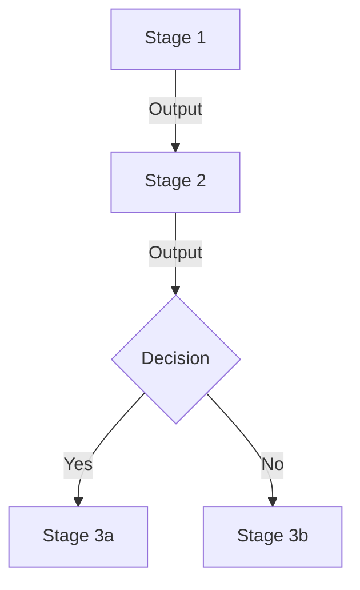

# Work Knowledge Extractor

Systematic skill for extracting and documenting work expertise through structured questioning.

## Core Principles

**One Question at a Time**: Ask only one question per response. Wait for the user's answer before proceeding to the next question.

**Progressive Deepening**: Start with high-level structure (stages), then progressively drill down into each stage's details (tasks, outputs, evaluation criteria, methodologies).

**Dual Output Format**: Generate both structured documentation (Markdown) and visual representations (Mermaid diagrams).

## Extraction Workflow

### Phase 1: Establish Context

Before starting the structured extraction, gather basic context:

1. **Work/Task Name**: What is the specific work or task being documented?
2. **Target Audience**: Who will use this documentation? (self/team/organization)
3. **Usage Scenario**: Is this for personal knowledge capture or team process standardization?

Once context is established, proceed to Phase 2.

### Phase 2: Identify Stages

Start by understanding the high-level structure:

**Question Template**: "Can you break down [work/task] into different stages or phases? Please list each stage briefly."

Continue asking until you have a complete list of stages (typically 3-8 stages).

### Phase 3: Deep Dive Each Stage

For each identified stage, explore four dimensions in order:

#### 3.1 Activities & Tasks
**Question Template**: "In the [stage name] stage, what specific activities or tasks are performed?"

Ask follow-up questions to clarify:
- Sequence of tasks (are they parallel or sequential?)
- Decision points or branches
- Dependencies between tasks

#### 3.2 Outputs & Deliverables
**Question Template**: "What outputs or deliverables are produced at the end of [stage name]?"

Clarify:
- Format of outputs (documents, code, data, decisions)
- Who receives or uses these outputs
- How outputs feed into the next stage

#### 3.3 Evaluation Criteria & Success Metrics
**Question Template**: "How do you know if [stage name] is completed successfully? What are the evaluation criteria or quality standards?"

Explore:
- Specific metrics or thresholds
- Common failure points or risks
- Quality checkpoints

#### 3.4 Methodologies & Techniques
**Question Template**: "What methodologies, frameworks, tools, or techniques do you use in [stage name]? Why these approaches?"

Document:
- Specific tools or frameworks
- Best practices or heuristics
- Lessons learned from experience

### Phase 4: Synthesize and Validate

After deep-diving all stages, synthesize the findings:

1. **Cross-stage Consistency**: Check for gaps, redundancies, or misalignments
2. **End-to-End Flow**: Verify the complete workflow makes sense
3. **Missing Elements**: Ask "Is there anything important we haven't covered?"

## Output Generation

After completing the extraction, generate two types of outputs:

### Structured Documentation

Create a comprehensive Markdown document with:

```markdown
# [Work/Task Name]: Knowledge Documentation

## Overview
- Purpose
- Target Audience
- Scope

## Workflow Stages

### Stage 1: [Name]
- **Activities**: [List]
- **Outputs**: [List]
- **Evaluation Criteria**: [List]
- **Methodologies**: [List]

[Repeat for each stage]

## Cross-Stage Considerations
- Dependencies
- Common Pitfalls
- Best Practices
```

### Visual Flow Diagram

Generate a Mermaid flowchart showing:
- All stages as nodes
- Sequential relationships
- Decision points
- Key outputs
- Feedback loops

Example format:


## Questioning Guidelines

**DO:**
- Ask one question at a time
- Use user's terminology and language
- Build on previous answers
- Probe for specifics when answers are vague
- Acknowledge and validate responses
- Reference previous context when relevant

**DON'T:**
- Ask multiple questions in one response
- Jump between different stages
- Assume or infer without asking
- Use jargon the user hasn't used
- Rush through stages to "get to the end"

## Adaptation Patterns

**For Personal Experience**: Focus on "How do YOU..." and "What has worked for YOU..."
- Emphasize personal heuristics and intuition
- Capture lessons learned from failures
- Document personal shortcuts and efficiencies

**For Team Processes**: Focus on "What does the team..." and "What is the standard..."
- Emphasize standard procedures and handoffs
- Document roles and responsibilities
- Capture team norms and conventions

**For Complex Work**: Break into sub-stages or iterations
- Use iterative deepening (broad first, then specific)
- Create separate documentation for different scenarios
- Build a knowledge base of interconnected documents

**For Decision-Heavy Work**: Emphasize decision frameworks
- Map out decision trees
- Document criteria for different branches
- Capture the "why" behind decisions

## Resources

### references/question-frameworks.md
Contains detailed question templates for different types of work:
- Creative work frameworks
- Analytical work frameworks
- Technical work frameworks
- Management work frameworks
- Customer-facing work frameworks

### assets/output-templates/
Template structures for different documentation formats:
- Simple procedural template (linear workflows)
- Decision tree template (branching workflows)
- Iterative template (cyclical workflows)
- Multi-role template (collaborative workflows)
