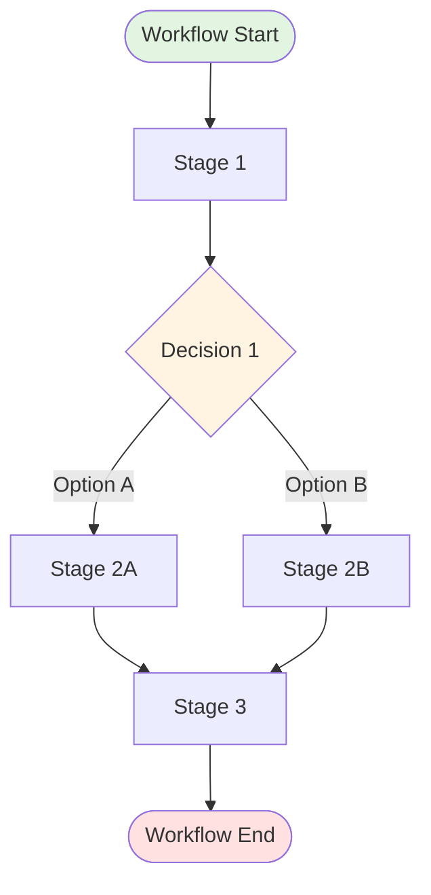

# [Work Name]: Decision-Based Workflow Documentation

## Metadata
- **Documentation Date**: [Date]
- **Target Audience**: [Who will use this]
- **Document Type**: [Personal/Team/Organizational]

## Overview

### Purpose
[Brief description of what this work accomplishes]

### Decision Complexity
[Summary of why this work involves multiple decision branches]

## Workflow with Decision Points

### Entry Point
**Trigger**: [What starts this workflow]
**Initial Context**: [What information or state exists at the start]

---

### Stage 1: [Stage Name]

**Purpose**: [Why this stage exists]

#### Activities & Tasks
1. [Task 1]
2. [Task 2]

#### Decision Point: [Decision Name]

**Question**: [What decision is being made?]

**Option A**: [Option description]
- **When to choose**: [Criteria for this option]
- **Next Stage**: [Which stage follows]
- **Outputs**: [What gets produced]

**Option B**: [Option description]
- **When to choose**: [Criteria for this option]
- **Next Stage**: [Which stage follows]
- **Outputs**: [What gets produced]

**Option C**: [Option description] (if applicable)
- **When to choose**: [Criteria for this option]
- **Next Stage**: [Which stage follows]
- **Outputs**: [What gets produced]

#### Evaluation Criteria
- How to validate the decision was correct: [Criteria]
- Common decision errors: [Description]

#### Methodologies
- Decision-making framework: [Framework or approach]
- Tools: [Tools that support this decision]

---

[Repeat for each stage and decision point]

---

### Stage N: [Convergence Stage] (if applicable)

**Purpose**: [How different branches come together]

#### Activities
1. [Activity 1]
2. [Activity 2]

#### Outputs
- [Output description]

## Decision Flow Summary

### Critical Decisions
1. **[Decision 1]** at [Stage 1]
   - Impact: [High/Medium/Low]
   - Reversibility: [Reversible/Irreversible]
   - Time sensitivity: [Urgent/Can wait]

2. **[Decision 2]** at [Stage 2]
   - Impact: [High/Medium/Low]
   - Reversibility: [Reversible/Irreversible]
   - Time sensitivity: [Urgent/Can wait]

### Common Decision Patterns

**Pattern 1**: [Pattern name]
- **Scenario**: [When this pattern occurs]
- **Typical Path**: [Stages involved]
- **Success Rate**: [If known]

**Pattern 2**: [Pattern name]
- **Scenario**: [When this pattern occurs]
- **Typical Path**: [Stages involved]
- **Success Rate**: [If known]

## Decision Support Tools

### Criteria & Rubrics
- **Rubric for [Decision 1]**: [Detailed criteria]
- **Rubric for [Decision 2]**: [Detailed criteria]

### Decision Aids
- **Checklists**: [Relevant checklists]
- **Templates**: [Templates that support decision-making]
- **References**: [External references or guidelines]

## Common Pitfalls in Decision-Making

### Pitfall 1: [Pitfall name]
- **Description**: [What happens]
- **How to avoid**: [Prevention strategies]
- **Recovery**: [What to do if it occurs]

### Pitfall 2: [Pitfall name]
- **Description**: [What happens]
- **How to avoid**: [Prevention strategies]
- **Recovery**: [What to do if it occurs]

## Visual Flow Diagram

## Resources & References

### Tools
- [Tool 1]: [Purpose for decision support]
- [Tool 2]: [Purpose for decision support]

### Related Documentation
- [Link/Reference 1]
- [Link/Reference 2]
