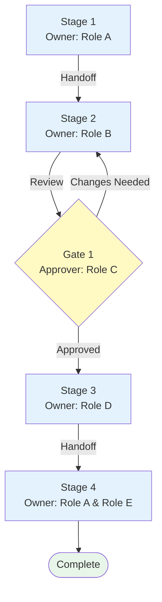

# [Work Name]: Team Workflow Documentation

## Metadata
- **Documentation Date**: [Date]
- **Target Audience**: [Team/Organization]
- **Document Type**: Team Process
- **Last Updated**: [Date]

## Overview

### Purpose
[Brief description of what this collaborative work accomplishes]

### Scope & Boundaries
- **In Scope**: [What this process covers]
- **Out of Scope**: [What is explicitly not covered]
- **Related Processes**: [Other processes that connect to this one]

## Roles & Responsibilities

### Role 1: [Role Name]
- **Responsibility**: [Overall accountability]
- **Key Stages**: [Which stages this role owns]
- **Skills Required**: [Critical skills or qualifications]

### Role 2: [Role Name]
- **Responsibility**: [Overall accountability]
- **Key Stages**: [Which stages this role owns]
- **Skills Required**: [Critical skills or qualifications]

[Repeat for each role]

## Workflow Stages

### Stage 1: [Stage Name]

**Owner**: [Primary role responsible]
**Participants**: [Other roles involved]

**Purpose**: [Why this stage exists]

#### Activities & Tasks
1. **[Task 1]** (Owner: [Role])
   - Details: [Sub-steps or considerations]
   - Handoff: [If this task hands off to another role]

2. **[Task 2]** (Owner: [Role])
   - Details: [Sub-steps or considerations]
   - Handoff: [If this task hands off to another role]

#### Handoffs & Transitions
- **From [Role A] to [Role B]**: [What gets passed, format, timing]
- **From [Role B] to [Role C]**: [What gets passed, format, timing]

#### Outputs & Deliverables
- **Output 1** (Producer: [Role], Consumer: [Role]): [Description and format]
- **Output 2** (Producer: [Role], Consumer: [Role]): [Description and format]

#### Evaluation Criteria
- ✅ [Success criterion 1]
- ✅ [Success criterion 2]
- ⚠️ [Common handoff issues or misalignments]

#### Methodologies & Techniques
- **Approach**: [Overall methodology]
- **Tools**: [Specific tools used]
- **Communication Norms**: [How roles coordinate during this stage]

---

[Repeat Stage section for each stage]

## Cross-Role Considerations

### Dependencies Between Stages
- [Stage 1] output must be approved by [Role] before [Stage 2] begins
- [Stage 3] requires input from both [Role A] and [Role B]

### Communication Protocols
- **Regular Updates**: [Cadence and format]
- **Escalation Path**: [How to handle blockers or issues]
- **Decision Authority**: [Who decides what]

### Collaboration Tools
- **Tool 1**: [Purpose and how it's used]
- **Tool 2**: [Purpose and how it's used]

### Shared Work Products
- **[Artifact 1]**: [Description, location, access permissions]
- **[Artifact 2]**: [Description, location, access permissions]

## Quality Gates & Approvals

### Gate 1: [Gate Name]
- **Location**: After [Stage X]
- **Approver**: [Role]
- **Criteria**: [What must be satisfied]
- **Common Issues**: [Typical reasons for rejection]

### Gate 2: [Gate Name]
- **Location**: After [Stage Y]
- **Approver**: [Role]
- **Criteria**: [What must be satisfied]
- **Common Issues**: [Typical reasons for rejection]

## Common Failure Points

### Point 1: [Failure Point Name]
- **Description**: [What typically goes wrong]
- **Root Cause**: [Why it happens]
- **Impact**: [Consequences]
- **Prevention**: [How to avoid]
- **Recovery**: [What to do if it occurs]

### Point 2: [Failure Point Name]
- **Description**: [What typically goes wrong]
- **Root Cause**: [Why it happens]
- **Impact**: [Consequences]
- **Prevention**: [How to avoid]
- **Recovery**: [What to do if it occurs]

## Performance Metrics

### Process Metrics
- **Cycle Time**: [Typical duration, target, SLA]
- **Handoff Time**: [Typical duration between roles]
- **Rework Rate**: [Percentage of work that comes back]

### Quality Metrics
- **[Metric 1]**: [Definition and target]
- **[Metric 2]**: [Definition and target]

## Visual Workflow Diagram

## Onboarding New Team Members

### Quick Start Guide for [Role 1]
1. [First thing to learn]
2. [Second thing to learn]
3. [Third thing to learn]

### Common Questions
- **Q**: [Common question from new team members]
  **A**: [Answer]

- **Q**: [Common question from new team members]
  **A**: [Answer]

## Resources & References

### Tools & Access
- **[Tool 1]**: [Access instructions]
- **[Tool 2]**: [Access instructions]

### Related Documentation
- [Link/Reference 1]
- [Link/Reference 2]

### Glossary
- **[Term 1]**: [Definition]
- **[Term 2]**: [Definition]

## Revision History
- [Date]: [Change description, who changed it]
